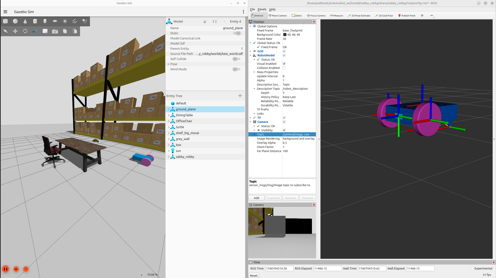

# **Sabby Robby \- A Two-Wheeled Differential Drive Mobile Robot**

## **Table of Contents**

* [Introduction](https://www.google.com/search?q=%23introduction)  
* [Features](https://www.google.com/search?q=%23features)  
* [Project Status](https://www.google.com/search?q=%23project-status)  
* [Getting Started](https://www.google.com/search?q=%23getting-started)  
  * [Prerequisites](https://www.google.com/search?q=%23prerequisites)  
  * [Installation](https://www.google.com/search?q=%23installation)  
* [Usage](https://www.google.com/search?q=%23usage)  
  * [Simulating in Gazebo](https://www.google.com/search?q=%23simulating-in-gazebo)  
  * [Visualizing in RViz2](https://www.google.com/search?q=%23visualizing-in-rviz2)  
  * [Controlling the Robot](https://www.google.com/search?q=%23controlling-the-robot)  
* [Development Workflow](https://www.google.com/search?q=%23development-workflow)  
* [File Structure](https://www.google.com/search?q=%23file-structure)  
* [Future Work](https://www.google.com/search?q=%23future-work)  
* [Contributing](https://www.google.com/search?q=%23contributing)  
* [License](https://www.google.com/search?q=%23license)  
* [Acknowledgements](https://www.google.com/search?q=%23acknowledgements)

## **Introduction**

Sabby Robby is a two-wheeled differential drive mobile robot designed and simulated in ROS 2\. This project covers the entire process from CAD design in SolidWorks to simulation in Gazebo and visualization in RViz2. The primary goal of this project is to create a foundational mobile robot platform for further development in areas such as navigation, manipulation, and autonomous systems.

This repository serves as a comprehensive portfolio piece, demonstrating skills in robot design, URDF/XACRO modeling, ROS 2 package creation, and simulation with Gazebo and RViz2.

## **Features**

* **CAD Design:** The robot was designed in SolidWorks, with careful consideration for link and joint definitions.  
* **URDF/XACRO:** The SolidWorks assembly was exported to URDF and then improved with XACRO for better organization and parameterization.  
* **Gazebo Simulation:** The robot is simulated in a custom Gazebo world.  
  * Differential drive plugin for robot control.  
  * Camera sensor for visual feedback.  
* **RViz2 Visualization:** The robot's state is visualized in RViz2, including TF frames and camera data.  
* **ROS 2 Integration:** The project is a ROS 2 package, making it easy to build, run, and integrate with other ROS 2 packages.

## **Project Status**

The project is currently in the simulation phase. The robot can be spawned in a Gazebo world, controlled via keyboard commands, and visualized in RViz2. The camera sensor is functional and provides a live video feed.

## **Getting Started**

### **Prerequisites**

* Ubuntu 22.04 LTS  
* ROS 2 Humble Hawksbill  
* Gazebo Garden (or the version compatible with your ROS 2 distro)  
* SolidWorks (for viewing/editing the original CAD files)  
* URDF Exporter for SolidWorks  
* colcon (ROS 2 build tool)  
* git

### **Installation**

1. **Create a ROS 2 Workspace:**  
   mkdir \-p \~/ros2\_ws/src  
   cd \~/ros2\_ws

2. **Clone the Repository:**  
   cd src  
   git clone \[https://github.com/YOUR\_USERNAME/sabby\_robby.git\](https://github.com/YOUR\_USERNAME/sabby\_robby.git)

3. **Install Dependencies:**  
   cd \~/ros2\_ws  
   rosdep install \--from-paths src \--ignore-src \-r \-y

4. **Build the Package:**  
   colcon build

5. **Source the Workspace:**  
   source install/setup.bash

## **Usage**

### **Simulating in Gazebo**

This will launch Gazebo with the custom world, spawn Sabby Robby, and set up the ROS 2 to Gazebo bridge.

ros2 launch sabby\_robby sabby\_robby\_gz.launch.xml

### **Visualizing in RViz2**

This will launch RViz2 with the pre-configured settings to visualize the robot model and TF frames.

ros2 launch sabby\_robby display.launch.xml

**Viewing the Camera Feed:** To visualize the live camera feed, add a Camera display in the RViz2 panel. In the display's topic dropdown, select /camera/image\_raw.

### **Controlling the Robot**

To control the robot's movement in the Gazebo simulation, open a new terminal and run:

ros2 run teleop\_twist\_keyboard teleop\_twist\_keyboard

You can then use the keyboard to send Twist messages to the /cmd\_vel topic, which will move the robot in the simulation.

## **Development Workflow**

This section outlines the process taken to create this ROS 2 package from the initial CAD model.

1. **SolidWorks Design & Export:**  
   * The robot was designed in SolidWorks.  
   * Links, joints, and coordinate systems were defined.  
   * The model was exported using the SolidWorks to URDF Exporter tool.  
2. **Initial URDF Validation:**  
   * The exported URDF was tested using an online URDF visualizer to ensure the model's integrity and joint connections were correct.  
3. **ROS 2 Package Creation:**  
   * A new ROS 2 package was created using ament\_cmake:  
     ros2 pkg create \--build-type ament\_cmake sabby\_robby

   * The meshes and urdf folders from the export were copied into this new package.  
4. **Configuration for ROS 2:**  
   * **package.xml:** Dependencies for robot\_state\_publisher, rviz2, ros\_gz\_sim, etc., were added.  
   * **CMakeLists.txt:** The install command was configured to include the urdf, meshes, launch, worlds, and rviz directories in the build.  
   * **URDF Mesh Paths:** The mesh file paths in the .urdf file were updated to use a file:// path with $(find sabby\_robby) to ensure ROS could locate them, for example:  
     `<mesh filename="file://$(find sabby\_robby)/meshes/base\_link.STL" />`

5. **Build and Test:**  
   * The package was built using colcon build.  
   * The initial visualization was tested using rviz2 and robot\_state\_publisher to confirm the model appeared correctly.

## **File Structure**

Here is an overview of the important files and directories in this repository:

sabby\_robby/  
├── CMakeLists.txt  
├── package.xml  
├── README.md  
├── launch/  
│   ├── display.launch.xml  
│   └── sabby\_robby\_gz.launch.xml  
├── urdf/  
│   ├── sabby\_robby.urdf.xacro  
│   ├── sabby\_robby\_gazebo.xacro  
│   └── camera.xacro  
├── meshes/  
│   ├── base\_link.STL  
│   ├── ... (other mesh files)  
├── rviz/  
│   └── config.rviz  
├── worlds/  
│   └── test\_world.sdf  
└── config/  
    └── gazebo\_bridge\_sabby\_robby.yaml

## **Future Work**

* Implement a navigation stack (Nav2).  
* Add more sensors, such as a LiDAR and IMU.  
* Integrate a robotic arm for manipulation tasks.  
* Develop autonomous behaviors.  
* Create a physical prototype.

## **Contributing**

Contributions are welcome\! If you have any ideas, suggestions, or bug reports, please open an issue or submit a pull request.

## **License**

This project is licensed under the MIT License \- see the [LICENSE](https://www.google.com/search?q=LICENSE) file for details.

## **Acknowledgements**

* Thanks to the open-source community for providing the tools and resources that made this project possible.
